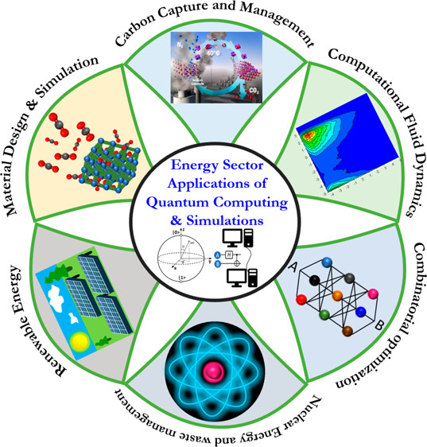
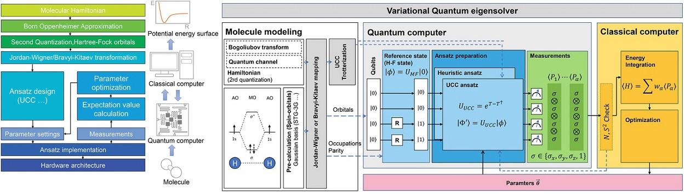

# PHY4268 Tutoriels 2024

Le calcul quantique impacte de nombreux secteurs technologiques et pharmacetiques. La Figure ci-dessous pour présente les applications dans le domaine de l'énergie.

Dans cette série de tutoriaux, sur le calcul quantique appliqué à la chimie quantique qui s'adressent aux étudiants de M1 de l'Université de Yaoundé I. Nous y explorons les différentes composantes d'un algorithme du VQE (Variational Quantum Eigensolver) permettant de faire des simulations moléculaires.

A l'issue de cette série de tutoriaux, en utilisant les frameworks de calculs de chimie quantique **PySCF** et de cacul quantique **qiskit**, l'étudiant doit être capable
  * d'expliquer certains concepts des méthodes modernes de chimie quantique : Hartree-Fock et la théorie fonctionnelle de la densité (DFT) ;
  * d'interpréter les résultats calculés en termes d'orbitales moléculaires et de modèles de structure électronique ;
  * d'implémenter l'algorithme de la VQE avec qiskit-nature;
  * d'appliquer cet algorithme pour prédire les structures moléculaires.

1. L'objectif du [tutoriel 1](https://github.com/NanaEngo/PHY4268_Tutoriels_2024/blob/main/PHY4248_%20Tutorial%201%20-%20Quantum%20Chemistry%20Modelling%20Basis_%20240425.ipynb) est de fournir les connaissances de base en chimie quantique nécessaire résoudre un problème de chimie avec HF et la DFT. De nombreux paramètres peuvent être modifiés, et certains ont un impact plus important que d’autres sur la précision et les ressources computationnelles. Cet ensemble de paramètres comprend le choix de l'état initial, le choix de l'ensemble de bases. De façon spécifique, à la fin de ce tutoriel, l'apprenant doit
	* avoir compris les notions théoriques élémentaires de la structure électronique des molécules en seconde quantification ;
	* être capable d'utiliser le framework PySCF pour
		* effectuer le calcul du champ moyen (SCF)
		* extraire
			* l'énergie totale
			* les index et les énergies du HOMO et du LUMO,
			* le résume des différentes énergies calculées
		* explorer le choix du set de bases.

2. L'objectif du [tutoriel 2](https://github.com/NanaEngo/PHY4268_Tutoriels_2024/blob/main/PHY4248_%20Tutorial%202%20-%20Qiskit%20Qubit%20Hamiltonian_%20240510.ipynb) est de présenter brièvement comment on établi une correspondance entre les opérateurs d'échelle fermioniques (Hamiltonien en seconde quantification ou Hanmiltonien fermionique) et les opérateurs de Pauli (Hamiltonien Qubit), à travers les transformations de Jordan-Wigner (JWT), de parité (PT) ou de Bravyi-Kitaev (BKT). De façon spécifique, à la fin de ce tutoriel, l'apprenant doit
  * avoir compris le principe de l'encodage d'un problème de structure électronique en seconde quantification sur un calculateur quantique;
  * être capable d'utiliser le framework qiskit-nature
      * obtenir l'Hamiltonien en 1ère quantification (avec PySCFDriver);
      * transformer celui-ci en Hamiltonien en seconde quantification (ou Hamiltonien fermionique);
      * transformer un Hamiltonien fermionique en Hamiltonien Qubit.

 3. L'objectif du [tutoriel 3](https://github.com/NanaEngo/PHY4268_Tutoriels_2024/blob/main/PHY4248_%20Tutorial%203%20-%20Qiskit%20VQE_%20240510.ipynb) est de présenter brièvement l'algorithme VQE (Variational Quantum Eigensolver), dans la contexte de la chimie quantique ou de la modélisation moléculaire. Le VQE utilise la méthode variationelle, et deux processeurs, quantique et classique, pour déterminer l'énergie la plus basse associée à la valeur propre de l'etat fondamental ou des états excités. A la fin de ce tutoriel, l'apprenant doit être capable d'utiliser Qiskit-Nature pour
  * renseigner la structure de la molécule et obtenir `ElectronicStructureProblem`;
  * obtenir les Hamiltoniens de 1ere et 2e quantification;
  * transformer le Hamiltoniens de 2e quantification en Hamiltonien de spin;
  * exploiter la symétrie $\mathbb{Z}_2$ pour effectuer la **reduction 2-qubit**;
  * evaluer l'énergie en utilisant le VQE.

4. A la fin du [tutoriel 4](https://github.com/NanaEngo/PHY4268_Tutoriels_2024/blob/main/PHY4248_%20Tutorial%204%20-%20Qiskit%20VQE%20with%20active%20space_%20240511.ipynb), l'apprenant doit être capable d'utiliser Qiskit-nature pour
  * calculer l'énergie de l'état fondamental d'un Hamiltonien quelconque;
  * définir l'espace actif d'un système moléculaire autour du niveau de Fermi (Niveau HOMO-LUMO);
  * calculer les énergies de l'état fondamental et des premiers états excités y afférent.
